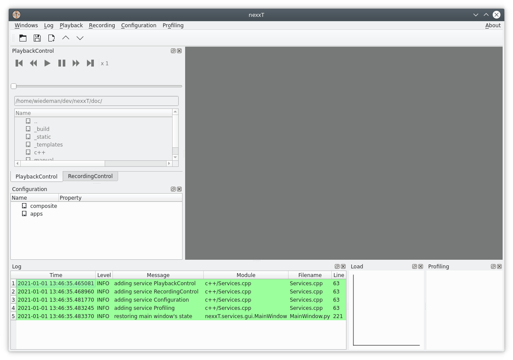
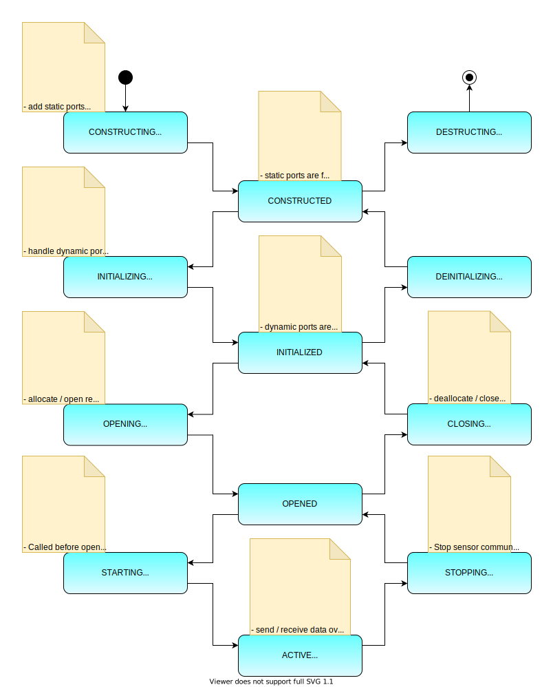

Tutorial
========

The purpose of this tutorial is to introduce the nexxT framework from different perspectives. We start with the perspective of a user who wants to be able to use predefined configurations. Then we show the perspective of an integrator who creates and manipulates configurations of filter graphs using nexxT. The last perspective is the developer view who develops filters ready to be integrated into the framework accessing both the python and the C++ API.

nexxT Nomenclature
------------------

**Terms and definitions**: A nexxT *configuration* provides one or more *applications*. *Applications* consist of a directed graph where the nodes are *filter* instances. *Filter* instances have input and output *ports*. Edges from output to input *ports* represent data flow *connections*. The *filters* can provide *properties* which can be manipulated in the GUI. For a clearer view it is possible to group subgraphs in so-called *composite filters*.

User Perspective
----------------

After installing nexxT as described in the :ref:`autogenerated/introduction:Installation` section, the command :ref:`commandline:nexxT-gui` is available in the virtual environment. Starting it with

.. code-block:: console

    $ nexxT-gui

brings up the nexxT graphical user interface:

GUI walkthrough
+++++++++++++++

The GUI consists of a main window with a menu, a toolbar and several dock windows. We are going to walk through the provided functionality briefly:

- The **Configuration** dock window and the Configuration menu are the main places where the user interacts with the configuration. It is possible to load and save configuration files, start and stop applications, modify property values and also manipulate the underlying filter graph.
- The **Playback Control** dock window and the Playback menu are the places where the user browses for files and activates them for playback. The window is enabled only if an application with a playback filter is active. It also provides the familiar control elements for navigating through a data file.
- The **Recording Control** dock window and the Recording menu provide control for recording data. The window is enabled only if an application with a recording filter is active.
- The **Log** window contains messages from both nexxT itself and the active plugins. It can be configured through the Log menu.
- The **Load** window shows the workload of the threads used in the application (when applications are active).
- The **Profiling** window shows detailed filter timings if enabled through the Profiling menu.

Example configuration
+++++++++++++++++++++

The example configuration is installed in *site-packages*/nexxT/examples/framework/example.json (the *site-packages* folder is inside the virtual envirnment where you have installed nexxT). This file contains two applications *live* and *sim* and a composite filter *visualization*. You can inspect the filter graphs by right-clicking the item in the configuration view and selecting *Edit Graph*:

The *live* application contains a camera grabber, an image processing filter, an HDF5 recorder and the visualization. The different colors in the graph are related to the different threads the filters run in. This application is ment to be executed live with a real camera. The CameraGrabber uses the first camera found on the system with default settings.

The *sim* application contains two readers for different flavours of input files (HDF5 or standard avi or mp4 containers), also the image processing filter and the visualization. This application is ment to be executed offline with data from disk. This allows to experiment with parameters and other algorithms.

The image processing here is a placeholder for a computationally expensive operation. The blurring is implemented in a non-optimal way for the benefit of minimizing project dependencies. One would obviously use libraries such as opencv or scipy for performing this task in a productivity environment.

Executing the live application
++++++++++++++++++++++++++++++

Right-clicking 

    .. image:: example-app-context-menu.png

on one of the applications shows different options for activating the application:

.. list-table:: Application Context Menu
    :widths: 30 70
    :header-rows: 1

    * - Context menu entry
      - Effect
    * - Select application       
      - Application is selected but left uninitialized
    * - Init application
      - Application is initialized. A Playback file is not yet selected.
    * - Init and load sequence
      - Application is initialized and the selected playback file is loaded. Playback is not yet started (only relevant for playback apps)
    * - Init, load and play
      - Application is initialized and the selected playback file is loaded. Playback is started (only relevant for playback apps)

Execute *Init application* of the live configuration. If a camera is connected to your computer, you should see two images, the original image as delivered from the camera and the processed, blurred image from the image processing filter.

    
The load monitor shows the load of the individual threads. In this example, the load introduced by the image processing is significant - the blue line is nearly always 100 %. This means that the image processing filter is probably slowing down the processing of the graph.

You might also see some warnings in the log monitor. They come from the `QMultimedia framework <https://doc.qt.io/qt-5/qtmultimedia-index.html>`_ package which is used to grab the images. Note that this choice has been made for demonstration purposes only and it minimizes the project's dependencies. In a productivity environment, the capturing filter might be replaced with a wrapper around a better suited library (e.g., opencv).

You are now able to take a recording using the buttons of the Recording Control toolbar.

You can also change properties in the configuration view. In the example above, the scale property of the visualization filters has been changed to better fit to the screen dimensions. Note that there are settings with an immediate effect (e.g., scale) while other settings need a re-initialization of the application before taking effect (e.g., caption). It's up to the filter developer to decide about the effect of changed properties.

Executing the sim application
+++++++++++++++++++++++++++++

Clicking on the deinitialize 

    .. image:: example-deinitialize.png
    
button on the toolbar sets the gui into the uninitialized state. You can now start the *sim* application to replay the recording you've just made. Therefore, right-click on the sim application and execute *Init application*. The *Playback Control* window is activated now and you can navigate to the .h5 file recording. When the file is activated in the browser, the *Play* button is enabled. Click it to start the playback from the recording.

In principle it shall be possible to also play .mp4 files with this application. Due to the limitations of the `QMultimedia framework <https://doc.qt.io/qt-5/qtmultimedia-index.html>`_ package the supported file types are limited. 

Integrator Perspective
----------------------

The integrator's perspective on the nexxT framework is to maintain and modify existing or create new configurations. The integrator uses ready-to-use plugins from developers (i.e., it is not strictly necessary to have programming skills for performing this task). The main tool for achieving these tasks is the *Graph Editor* (see :ref:`tutorial:Example configuration`). In the next paragraphs, we show how to create a new configuration:

Click on the *New config* button in the toolbar and choose an appropriate location. Right-click the *apps* entry in the **Configuration** dock window and choose *Add application*:

    .. image:: example-add-application.png
    
You can change the name of the new application by pressing F2 in the configuration view. Start the graph editor of this application. The graph will be empty, and we are going to populate it. Right-clicking on an empty space in the graph editor brings up this pop-up menu:

    .. image:: example-graph-editor-context-menu.png
    
As you can see, there are multiple options to add filters:

.. list-table:: Graph Editor Context Menu
    :widths: 23 40 33
    :header-rows: 1

    * - Context menu entry
      - Effect
      - Discussion
    * - Add filter from file
      - You can choose a python file or a shared object / DLL. This file will be scanned for Filter classes and a list of available filters will be presented. In case a python file is created, this file is imported as a python module.
      - While this method is pretty easy and straight-forward, importing python code like this doesn't scale up. It is recommended that filters are imported by one of the two other ways. As of today, nexxT uses an absolute path to the file. After saving a config, it might be necessary to change these paths in the JSON file to be relative to the configuration file.
    * - Add filter from python module
      - You can choose a python module from the current python environment (dot notation can be used for packages).
      - This method is preferrable over the file method, if your filter is packaged in a standard python package which is installed via pip or similar tools. However, integrators have to remember the python module names of their filters.
    * - Filter Library
      - Filters which are registered with the 'nexxT.filters' entry point (see :py:class:`nexxT.interface.Filters.FilterSurrogate` for more information) are listed here in a tree structure. This is possible for filters defined in both domains, python and C++.
      - Most convenient approach for integrators. The method requires that the filter is installed with the correct entry_point definition in setup.py or setup.cfg.

Let's add a HDF5 reader to the application, using the filter library (*Filter Library* -> *harddisk* -> *HDF5Reader*). You will be presented with an empty filter:

    .. image:: example-hdf5-reader-empty.png

The HDF5 reader uses the concept of **dynamic ports** for being able to support arbitrary streams. These dynamic ports have to be defined by the integrator. Filters and ports provide context menus where dynamic ports can be added, removed and renamed. Each stream in the HDF5 file is then mapped to a dynamic output port with the name of the stream. The HDF5 reader can suggest port names from a template HDF5 file. Therefore, click on *Suggest dynamic ports ...* and choose the HDF5 file which was recorded in :ref:`tutorial:Executing the live application`.  You are presented with this suggestion:

    .. image:: example-suggest-ports.png
    
After acceptance, the video port is added to the filter. Another way to achieve the same effect is to use the filter's context menu and add a new dynamic output port with name video.

By default, new filters are running in the main thread (indicated by the green color). However, the HDF5 reader is designed to run in a seperate thread instead and it will emit a warning in the logs if it runs in the main thread. Therefore, we assign a new thread *reader* to it using the filter's context menu. Note the color change after the operation.

Next, we will add the visualization node for the video stream to the graph editor (*Filter Library* -> *examples* -> *framework* -> *ImageView*). The green color indicates that this filter is running in the main thread. Visualization filters are required to run in the main (aka GUI) thread, because of QT's requirements for gui elements. This filter defines some properties which can be changed in the configuration view, namely *scale* and *caption*.

We can now connect the reader's output port with the visualization's input port by dragging a connection between the two:

    .. image:: example-reader-vis-connected.png
    
Now it's time to save the configuration in the tool bar and test it. Initialize the application with the context menu in the configuration view and choose the .h5 file from the previous section. You should see the recorded data:

Developer Perspectives
----------------------

One of the first things to decide when using nexxT is the data format to be used in the configuration files. There are a lot of possible choices, each with some pros and cons. A fundamental requirement on the data format is that the serialization and deserialization operations shall be efficient. This is because the data is passed between filters in the serialized format and so these operations are heavily used while running a filter graph. The following (incomplete) table gives some hints on how data may be represented:

.. list-table:: 
    :widths: 26 37 37
    :header-rows: 1
    
    * - Method
      - Pros
      - Cons
      
    * - pickle
      - * (De-)serialization is easily implemented in python with pickle.dumps and pickle.loads.
        * Self-contained
      - * Can be slow depending on the data
        * Unusable in the C++ world

    * - `flatbuffers <https://google.github.io/flatbuffers/>`_
      - * Efficient and cross platform (de-)serialization library
        * Self-contained
      - * Depends on 3rd party library

    * - ctypes
      - * The approach can be used in both domains, python and C++.
        * In python, it is easy to define C structures using the ctypes library
        * In C++, regular C structs can be used
        * (De-)serialization is efficient. Zero-copy reading is supported.
        * Deserialized data access is straight-forward and the same between python and C++.
      - * If the structures are subject to change over time, manual version management is required (i.e., old structure definitions have to be kept and a version number must be present)
        * Synchronization between C++ and python type definitions might be tedious.
        * Not self-contained (structure definitions need to be kept seperate from the data).
        
For this tutorial, we decided to use the ctypes approach. Here at ifm we are using a proprietery data format which is also heavily using ctypes in the python world but doesn't show the cons of the pure ctypes approach listed above.
        
Python
++++++

Data Format
^^^^^^^^^^^

The data format is defined in the module :py:mod:`nexxT.examples.framework.ImageData`. It consists of the ImageHeader definition and two methods for deserializing and serializing images.

    .. literalinclude:: ../../nexxT/examples/framework/ImageData.py
        :pyobject: ImageHeader
        
The image data format is very simple, first there is a data header with image meta information followed by the raw image data buffer. 

The deserialization operation converts the so-defined data into a numpy array, usually without copying the data. In nexxT, QByteArray instances are used to pass data around, so the input argument of the deserialization operation is a QByteArray instance.

    .. literalinclude:: ../../nexxT/examples/framework/ImageData.py
        :pyobject: byteArrayToNumpy
        
The key for the zero-copy operation is to use memoryview(...) together with python's buffer protocol to access data.

Similar ideas are used in the serialization implementation where only one copy of the data is made before passing it to the framework.

    .. literalinclude:: ../../nexxT/examples/framework/ImageData.py
        :pyobject: numpyToByteArray

A first simple filter
^^^^^^^^^^^^^^^^^^^^^

Having the data format defined, we can go on and show how to write a simple filter. The :py:class:`nexxT.examples.framework.ImageBlur.ImageBlur` filter has one static input and one static output port. It applies a blurring operation with an adjustable filter size. 

    .. literalinclude:: ../../nexxT/examples/framework/ImageBlur.py
        :pyobject: ImageBlur

The constructor creates the ports and defines the kernelSize property. The onPortDataChanged method is called from nexxT whenever new data arrives at the input port. 

Note that nexxT always takes care about using the filter's thread for callbacks like onPortDataChanged(...), unless explictely otherwise stated in the documentation. A manual synchronization for data consistency shall not be necessary in a filter. That was one major drawback of our previous framework and the source of hard-to-find deadlocks and segmentation faults.

NexxT manages the lifecycles of the filters using a state machine. The onPortDataChanged(...) callback is executed after filters have reached their *ACTIVE* state. NexxT also ensures that no data samples are lost during initialization of the application or because some filters are slow.

**Slow filters will slow down the whole filter graph**. This is a major difference to ROS and ROS2 where data samples are discarded by default in favour of real-time performance, which results in difficulties getting reproducable results when developing potentially slow algorithms with data from disk.

The constructor and the onInit(...) method of a filter are called not only when executing an application but also when the filter graph is manipulated. For that reason, it is strongly recommended, that these methods are fast. Slow operations shall be delayed until onOpen(...) or onStart(...) is called.

Display filters
^^^^^^^^^^^^^^^

Display filters present visualizations of incoming data. They are normal nexxT filter instances. We will shortly walk through the :py:class:`nexxT.examples.framework.ImageView.ImageView` filter with a focus on how the filter is written (and not how the display is achieved):

    .. literalinclude:: ../../nexxT/examples/framework/ImageView.py
        :pyobject: ImageView.__init__
        
The constructor adds the static input port where the images arrive and it defines two properties for the window caption and the scale factor of the view. In this constructor it is demonstrated how to use a slot for getting notified about changed properties.

An important aspect is that the actual widget is not created in the constructor, but the creation is delayed until the onOpen(...) function as already discussed in the previous section :ref:`tutorial:A first simple filter`.

    .. literalinclude:: ../../nexxT/examples/framework/ImageView.py
        :pyobject: ImageView.onOpen

In the onOpen(...) function, the display widget is created and registered in the main window. Therefore, it queries nexxT's MainWindow service and registers the display with the subplot method of the main window. The caption of a mainwindow can optionally include a "[row, col]" definition to layout multiple views in a grid inside a single MDI window.

    .. literalinclude:: ../../nexxT/examples/framework/ImageView.py
        :pyobject: ImageView.onClose
        
The onClose(...) method is the inverse of onOpen(...). It releases the widget from the main window and clears the reference to it.

C++
+++

**What are the benefits of using C++ instead of python?** While you can argue that performance is not affected much if the filter only uses a wrapper around a library such as opencv, the `python GIL <https://wiki.python.org/moin/GlobalInterpreterLock>`_ is a factor which might limit performance in a multithreaded application like nexxT. In a nutshell it means, that whenever python code is executed, the interpreter has the GIL locked to prevent other threads from modifying interpreter states. C extensions like numpy, opencv or PySide2 unlock the GIL during long-duration calls. As a consequence, heavily using pure python will slow down other threads because the GIL limits parallel execution. Using C++ filters, it is possible to design operations which are not affected by the GIL at all.

Filters in C++ are very similar to filters in python. They are defined using a class inheriting from :cpp:class:`nexxT::Filter` and overwriting the same methods just like in python. One difference is the usage of nexxT services like the MainWindow service (see :ref:`tutorial:Display filters`). In C++, these services are of type QObject. Therefore, you need to use `QMetaObject::invokeMethod <https://doc.qt.io/qt-5/qmetaobject.html#invokeMethod>`_ for accessing slots of the services.

The plugin library links against the nexxT runtime library (*libnexxT.so* or *nexxT.dll*) which is provided in nexxT installation directory. It also links against a QT library used for development. Note that during runtime, the QT library bundled with PySide2 will be used regardless of which QT library has been used to develop. To be on the safe side, you should use a matching major.minor version, the patch level should be non-relevant. For example, to compile a plugin for the PySide2 version 5.14.2.3, you can use QT 5.14.0. Plugin libraries do not use shiboken2 for exposing the filters in python, instead they use a QLibrary interface.

Note that - unlike pure QT - PySide2 does not provide any compatibility guarantees between minor or patch level releases. This means that it is generally not possible to use nexxT with a different PySide2 version than it was compiled against. 

Each plugin library can announce one or more filter classes.

Camera Grabber
^^^^^^^^^^^^^^

Again, we will shortly walk through the CameraGrabber class with a focus on how to write a nexxT filter and not how to grab images from a camera. We use the `QMultimedia framework <https://doc.qt.io/qt-5/qtmultimedia-index.html>`_ for that.

    .. literalinclude:: ../../nexxT/tests/src/CameraGrabber.hpp
        :language: c
        :caption:
        
The CameraGrabber filter is defined in this header file. Because it uses signals and slots we need the Q_OBJECT macro in the class. We also need to call the macro :c:macro:`NEXXT_PLUGIN_DECLARE_FILTER` for being able to announce this filter in the plugin library.

    .. literalinclude:: ../../nexxT/tests/src/CameraGrabber.cpp
        :language: c
        :start-after: LITERAL_INCLUDE_START_1
        :end-before: LITERAL_INCLUDE_END_1
        
The constructors and destructors are straight forward. Long-running operations like camera discovery are delayed until onOpen(...). The constructor passes the BaseFilterEnvironment instance through to the base class just like the python filters do.

    .. literalinclude:: ../../nexxT/tests/src/CameraGrabber.cpp
        :language: c
        :start-after: LITERAL_INCLUDE_START_3
        :end-before: LITERAL_INCLUDE_END_3

The onOpen(...) method create the necessary classes from the QMultimedia framework and sets up signal and slot connections for receiving new images and error handling. Note that this ensures that the slots are called in the filter's thread. onStart(...) starts the capturing, onStop(...) and onClose(...) are the inverse functions. Logging can be performed by using the macros defined in :ref:`cplusplus:Logging`.

    .. literalinclude:: ../../nexxT/tests/src/CameraGrabber.cpp
        :language: c
        :start-after: LITERAL_INCLUDE_START_2
        :end-before: LITERAL_INCLUDE_END_2

The newImage(...) slot is called when a new image arrives through the QMultimedia framework. The data is serialized according to :ref:`tutorial:Data Format` and transmitted over the output pin.

Plugin Definition
^^^^^^^^^^^^^^^^^

For being able to announce the C++ filters, the plugin needs to be defined. This is performed here for the CameraGrabber class and other filters defined in the same library.

    .. literalinclude:: ../../nexxT/tests/src/Plugins.cpp
        :language: c

Debugging
+++++++++

Visual Studio Code
^^^^^^^^^^^^^^^^^^
To start with VS Code make sure the Python extension for VS Code is installed (`see here <https://code.visualstudio.com/docs/languages/python>`_).

Open VS Code in your source code directory via menu ("File/Open Folder") or cd in your terminal of choice to your folder and start VS Code by typing :code:`code .` (dot for the current directory).
First we need to tell VS Code which python interpreter to use.
Open the settings.json file in your .vscode directory (or create it) and add following variable definition: :code:`"python.pythonPath": "/folder/of/to/python/interpreter/python.exe"`. The path should be an absolute path.

If the interpreter is located in a virtual environment, VS Code will recognize it and activate it automatically.
Important: Make sure that at least one .py file is opened in the editor when starting debugging, otherwise the venv will not be activated.
Btw, with these settings at hand, the venv will also be started automatically when we open a new terminal ("Terminal/New Terminal").

Next step is to create the launch.json file for our debug session (manually or via "Run/Add configuration"). Your launch.json file in .vscode folder should look like this:

.. code-block:: JSON

    {
        "version": "0.2.0",
        "configurations": [
            {
                "name": "Python: Modul",
                "type": "python",
                "request": "launch",
                "module": "nexxT.core.AppConsole",
                "justMyCode": false
            }
        ]
    }

The module information is the critical part. Under the hood VS code will invoke :code:`python -m <module>`.
With the "justMyCode" setting, we can extend debugging to external code.
